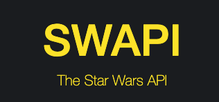

# scala-cli-as-better-shell-scripting

This Repository is based on the Blog Post by Dave Smith [Better Shell Scripting with Scala-CLI](https://xebia.com/blog/better-shell-scripting-with-scala-cli/).

## How to run it

- Shell
- Scala-CLI

### Shell

Run the content of the file ``chmod.sh`` on your command line.
```shell
chmod 777 star-wars.sh
```

Then you are set up to run ``star-wars.sh``.
```shell
./star-wars.sh
```

### Scala-CLI
First, you will need to install [Scala CLI](https://scala-cli.virtuslab.org/install/).

Then, you can run either script:
```shell
scala-cli star-wars-naive.sc
```
```shell
scala-cli star-wars.sc
```

## Motivation
This repository displays how `Scala-CLI` scripts offer better ergonomics for SWE when running basic scripts instead of using `shell` or `bash`.

For that, a small script will pull information from the [*Star Wars API*](https://swapi.dev/).



The target is to generate JSON files in the `output` folder with information from the planets listed in the file `planet.txt`